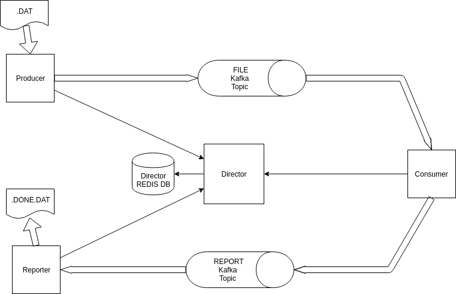

# Ragna Sample Data Pipeline


## Workflow



### Components

#### Producer

Reads a `<FILENAME>.dat` file from local `$HOME/data/in`, splits line files in streaming mode and ingests each line into FILE kafka topic. Register file processing in `Director` service as `IN_PROCESS`.

#### Consumer

Consumes each line from FILE kafka topic, parses it, and register required stats in  `Director` service. When last line for a given file is reached, sets file processing status to `PROCESSED` and sends file name related to last processed line to  REPORT kafka topic.

#### Director

Keeps file processing status for a given file. Record all summarization data required to generate `.done.dat` file. When required, downloads `.done.dat`file data.

##### Director REDIS DB

Keeps File Pipeline status and summarization data.

#### Reporter

Receives filename message from REPORT kafka topic, requests Summarized file processing data from `Director` and saves the `<FILENAME>.done.dat` report in local `$HOME/data/out`.

#### Kafka Topics

##### File

Channel to transfer each `.DAT` file line.

##### Report

Notifies `Reporter` component about finished file processing.

## Tech Stack

* Spring Boot
* Spring Data Redis
* Jedis
* Apache Camel
* NoSql
    * Redis
    * Apache Kafka

### Evolution

#### Refactorings

Current Stack is a POC. Despite that the current components design are loosely coupled enough to easily evolve to production quality deployment in Kubernetes or AWS. 

All components are organized with Separation of Concerns (SOC) in mind. So following components in package structure can be refactored to a stand-alone Spring Boot project each:

* `ragna.pipeline.consumer`
* `ragna.pipeline.director`
* `ragna.pipeline.producer`
* `ragna.pipeline.reporter`

**Obs** In `director` component we should implement REST API (not implemented in poc).

Next component should be provided as binary dependency:

* `ragna.pipeline.common`

#### Cloud Enable

The current workflow is already impĺemented using Redis and Kafka DBs, so communications can be considered well grounded already.

Despite that we should observe the following points:

* Parameterize configurations using central config repo as Spring Config
* Implement discoverability using Spring Cloud / Eureka
* Implement Telemetry / Centralized logs solutions
* Implement a deployment pipeline using Jenkins, for example
* Implement Terraform provisioning scripts for DB infrastructure

#### Scalability/Performance Notes

Since we rely on separated and scalable NoSQL DBs as communication channel/storage (Kafka) and stats computation (Redis), this design is well grounded for future scalability needs yet fully functional for a small deployment. 

Further details depends on target platform (Kubernetes or AWS/GCP).

We should define a correct partitioning strategy that could be applied to both services and DBs.

## Running POC

### Pre-requisites

* Java 8
* Docker, Docker Compose

### Create directories

```
 mkdir -p ~/data/{in,out}
```

### Run Docker test DBs

```
docker-compose up
```

### Build Project

```
./gradlew build

```

### Run Project

```
cd build/libs/
java -jar rgn_data_pipeline_poc-0.0.1-SNAPSHOT.jar
```

## TODO

* add camel route testing
* Implement Director REST API
* split components in self contained gradle projects
* write a new `docker-compose.yml` for both splitted components and DBs
* Fix RedisTemplate TypeConverters
* define and implement rules for already processed files
* improve error handling
* define correct ordering/ warranty policy for kafka
* define replay/resume file processing
* extract each component package to a dedicated Spring Boot Project
* implement `director` REST API
* further *todo*  items see **evolution** section


